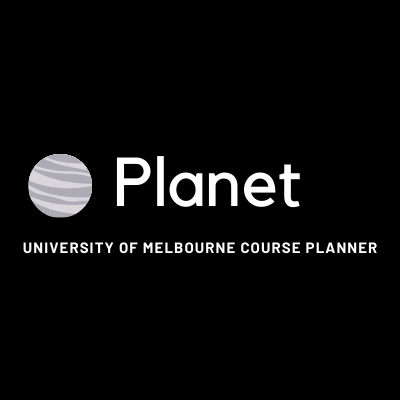

# Planet

Open Source University of Melbourne AI Course Planner made using React.js and Python. (In Progress)

<p align = "center">

</p>


# Planet | A University of Melbourne Course Planner

- Built to help students plan out their courses and find the best subjects for their degree.
- Offers a recommendation system to suggest best subjects according to their current chosen subjects.
- Features a download feature to download their entire course plan.
- A project to make the subject selection process for Unimelb students better.

This is the first version of this web application and better versions including the above features would be out soon.


# Development Team - Leads
- Pulkit Aggarwal (pulkit@student.unimelb.edu.au)
- Parth Arora (partharora.india@gmail.com)

# Tools Used
- React (Cross-platform web framework for building the front end)
- MongoDB (To store and retrieve data)


# Contribute
Make a pull request to contribute or contact any of the project leads to understand and help in making the future versions. We learned React and other technologies from scratch in order to make this project, even if you think you don't know these technologies we would love to help you get through the process.

# Installation 

## Node.js Installation

In the root folder, run the command:

```shell
npm install
```

### React JS Installation

Now, go into the `client` folder and run the command:

```shell
cd client
npm install
```
Now, in the same `client` folder run the command:

```shell
npm start
```
If this doesn't work, please don't hesitate to contact any of us.

# Relevant Docs

 - React js Tutorial https://reactjs.org/tutorial/tutorial.html
 - Mern Stack Deployment on Heroku Tutorial https://www.youtube.com/watch?v=5PaUiPyBDJY
 
